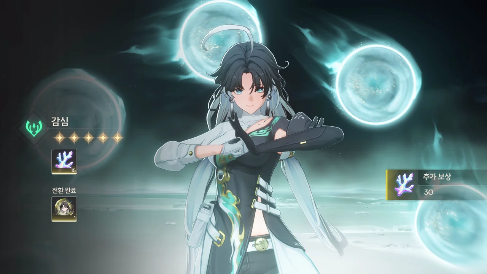

파수인 픽업이 드디어 왔다.

자세히 찾아본 건 아니지만, 듣기로는 파수인이 힐러 역할이라고 한다. 그러면 2 파티에 벨리나 대신 넣으면 되겠네.

마침 별소리를 7,200개 정도 모아뒀으니, 뭔가 비벼볼 만은 할 거다.





어림도 없었다.



무기 픽업에서 뭔가 나오길 바라는 건 욕심이다.

그나저나 요새 증폭기 픽업만 계속 나오는 거 같은데.

이것저것 끌어모아도 10 연차를 돌리기 힘들기 때문에, 일단 여기서 멈추기로 했다.





양양은 어느새 풀돌을 찍었고, 치샤 역시 5돌이 되었다. 알토랑 모르테피는 키울 생각이 없으니 그냥 그런가 보다 하고 있고.

***

별소리가 조금 모였기에, 가챠를 한 번 더 돌렸다.

... 5성이 나와 두근거렸는데 나오라는 파수인은 안 나오고 감심이 나왔네.

하... 저번처럼 또 필드를 박박 긁어먹어야 하나? 그래도 80 연차를 채우긴 힘들 거 같은데...
