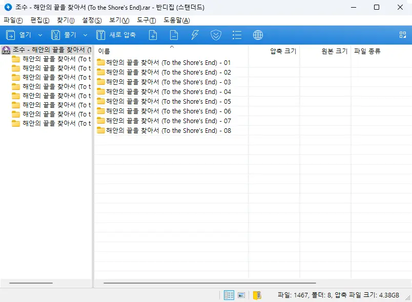

결론부터 말하자면, 더 이상 게임이 의욕적으로 손에 잡히지 않는다. 남은 건 오직 여태껏 해오던 관성뿐이고.

게임을 하며 의욕부진을 겪는 건 새삼스러운 일이 아니다. 늘 있어왔고, 앞으로도 그럴 테니까. 하지만 게임을 하고 싶지 않다고 느끼는 걸 넘어 게임을 삭제하고 싶다고 생각하게 된다는 점에서 이번 일은 상당히 의외이다.

그리고 거기에 대해 '왜?'라고 묻는다면, 아마 내 대답은 '번역 때문에'가 되겠지.

&nbsp;

명조의 번역 문제는 하루이틀의 문제가 아니다. 출시 초기부터 있었던 번역 문제는 2.0 버전이 코앞까지 다가온 지금까지도 고쳐진 부분 하나 없이 그대로 남아있다. 내가 번역으로 그렇게 까대던 붕괴: 스타레일도 2.0 버전이 되기 전에 번역을 말끔하게 고쳤는데 말이지.

내가 게임을 하며 제일 중요하게 보는 것 중 하나가 게임의 설정과 스토리이다. 그리고 게임 개발사가 해외에 있을 경우, 이를 전달하는 번역은 게임 스토리나 설정 못지않게 중요한 역할을 맡게 된다.

그런 점에 있어서 호요버스의 번역 품질은 정말 수준급이었다고 생각한다. 붕괴: 스타레일 극초창기의 게임 재창조급 오역을 제외하면 호요버스 게임의 번역은 무얼 패러디했는지까지 알 수 있을 정도로 잘 되어 있었으니까. 미호요의 캐치프레이즈, 'Tech Otakus Save The World'에 걸맞은 번역이었다.

하지만 명조의 번역은 실망스럽기 그지없다. 오죽하면 나무위키에 [관련 문서](https://namu.wiki/w/%EB%AA%85%EC%A1%B0:%20%EC%9B%8C%EB%8D%94%EB%A7%81%20%EC%9B%A8%EC%9D%B4%EB%B8%8C/%EC%98%A4%EC%97%AD)까지 생겼을까.

### 두서없는 번역

금주 스토리는 난해하기로 악명 높은데, 정작 그걸 처음부터 다시 차근차근 정리해서 읽어보면 전혀 이해 못 할 수준이 아님을 알 수 있다. 그렇다면 사람들이 왜 금주 스토리를 난해하다고 생각했던 걸까? 바로 번역이 엉망진창이었기 때문이다.

번역 중 용어를 재창조하는 건 예삿일이다. 「용의 뿔」(角)이 '용의 별자리'로 번역되고, 「아부」(阿布)가 '포포'로 번역되었으며, 「무상선주」(无相燹主)가 '더 엑시온'으로 번역되었다. 원문을 무시하고 통일성마저 내다 버린 번역 때문에 본래라면 서로 연관성을 내비쳤어야 할 대사와 설정이 따로 놀게 되었다.

뭐? 그래놓고서 '본사의 허가를 받은 번역'이라고? 그냥 본사에게 질책받기 싫어서 한 소리 아냐?

### 오마주를 무시하는 번역

원신이나 붕괴: 스타레일이 그랬던 것처럼, 명조 역시 업적명에 오타쿠 드립을 한가득 쳐놓았는데, 정작 번역이 엉망이라 그 많은 드립이 하나도 반영되지 않았다고 한다.

> 「――投影, 开始」
> "――"
{.bq}

오타쿠라면 못 알아볼 리 없는 에미야 시로의 명대사이다. 그런데 명조는 이걸 '――홀로그램, 스타트'라고 번역했다.
소아온의 "링크, 스타트" 패러디인 줄 알았다는 사람도 있었으니, 말 다했지.

마찬가지로 「我也想成为正义的伙伴」 역시 에미야 시로의 "나도 정의의 사도가 되고 싶어"를 그대로 가져다 놓은 업적명이지만, '나도 정의의 동반자가 되고 싶어요'라고 성의 없이 직역을 해버렸다.

뭐, 그것 말고도 어마금 엑셀러레이터의 대사, 「前方的道路一方通行」(이 앞은 일방통행이다)를 '전방 도로 일방 통행'이라고 번역하기도 했고.

이외의 업적 오역은 [갤러리의 누군가](https://gall.dcinside.com/wutheringwaves/584809)가 아주 친절하게 잘 정리해 주었다.

### 혐오스러운 번역 기조

오역도 오역이지만, 번역의 기조 역시 혐오스럽기는 마찬가지이다. 그놈의 한영혼용체.

지금은 수많은 뭇매를 맞고 수정되었지만, 나는 아직도 '아미너스 타이거', '군침이 싹 도노'를 기억한다. '결정 웨이브 플레이트', '황룡 아카이브', '공명 어빌리티', '다크 블루의 찬송'과 같은 혐오스러운 번역은 아직도 남아있고.

누군가가 이렇게 말했는데, 너무나도 공감되더라.

> 명조 번역은 50~60대 할아버지가 대충 인터넷 둘러보고 '이 정도면 Young 한데? MZ 한데?'라고 생각하며 한 번역이다.
{.bq}

***

번역 기조는 물론이요, 번역 수준까지 흉참하기 그지없으니, 게임의 설정이나 스토리가 아무리 감동적이고 훌륭해도 눈에 들어올 리 없다.

명조가 다른 게임과의 차별점으로 내세운 것 중 하나가 사내 번역팀을 쓴다는 것이었는데, 번역이 이 꼬락서니면 차라리 외주를 주는 게 더 나을 것 같다는 생각이 든다.

그래서일까. 2.0 버전 업데이트가 코앞까지 다가온 지금, 나는 1.4 버전 조수 임무 사진을 쌓아만 둔 채 글을 쓰고 있지 않다. 번역 품질이 좋지 않은 건 여전했거든. 듣자 하니, 2.0 버전 미리 보기 공식 방송에서도 번역을 엉망진창으로 해두었다고 하더라고. 안 좋은 쪽으로 한결같다.

1.4 버전 조수 임무에 나온 파수인의 모습은 정말 가슴을 울릴 정도로 멋졌지만, 흉참한 번역 수준을 생각하니 손가락이 차마 움직이질 않는다.

&nbsp;

명조 이전에 한 타워 오브 판타지 역시 번역의 품질이 좋지 못했는데, 명조까지 번역 문제가 터지니 이제는 이런 부류의 게임이 하기 싫어지려 한다. 어쩌면 내게 맞는 건 발더스 게이트 3처럼 스토리가 한 번에 끝나는 부류의 싱글 플레이 게임이 아니었을까 하는 생각조차 든다.

한 가지 확실한 건, 내가 명조를 접게 되더라도 다시 호요버스 게임으로 돌아가진 않을 거라는 거지만. 거긴 다른 의미로 정이 떨어졌잖아?
