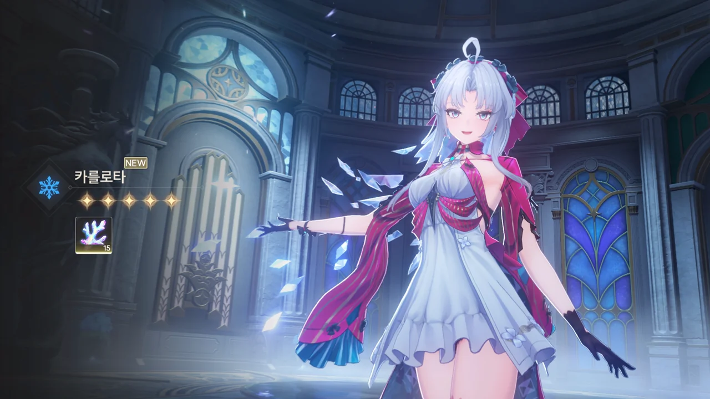
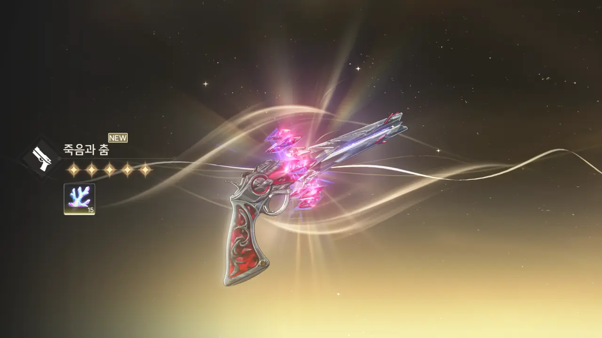

본래 내게 가챠 계획이 없었던 건 아니다.

지금 내가 주력으로 쓰고 있는 파티는 금희-절지-벨리나 파티이다. 그런데 묘하게 메인 딜러인 금희의 딜이 부족하다. 서브 딜러로 쓰기 위해 편성한 절지의 딜이 더 세다고 느낄 때가 한두 번이 아니다.
왜 금희의 대미지가 부족하다고 느끼는 걸까? 혹시 금희에게 전무 대신 상시 대검을 들려줘서 그런 걸까?

그래서 원래 내 가챠 계획은 앞으로 있을 금희 픽업 복각 때까지 별소리를 악착같이 모은 후, 금희 전무를 뽑는 것이었다. 별소리가 남으면 금희의 공명 체인을 조금 더 올려주는 것도 좋을 것이고.

&nbsp;

2.0 버전이 열리고, 별소리를 얻기 위해 카를로타 체험을 해보았다. 그런데 와... 이거 물건이네? 딜이 시원시원하게 박히고 있어! 캐릭터도 이뻐!

그 순간 내 미래 가챠 계획은 산산조각 났다.



카를로타를 뽑긴 뽑았다. 그런데 이번 픽업의 맛은 좋은 것도, 나쁜 것도 아닌 것 같다.
반천장에서 벨리나가 나온 건 나쁜 일이다. 능양이나 카카루가 나오는 것보다는 좋은 일이지만, 아무래도 반천장이니까. 하지만 벨리나가 고작 14 연차만에 나온 건 좋은 일이다. 70~80 연차를 꽉꽉 채워서 나온 게 벨리나였으면 정말 슬펐을 거야.
카를로타 역시 50 연차 정도에 나왔다. 이건 상당한 의외이다. 벨리나와 카를로타 둘을 합쳐 대략 70 연차를 돌렸으니, 긍정적으로 생각하면 반천장에서 카를로타를 뽑고 벨리나를 보너스로 얻은 것이라 볼 수도 있다. 반천장 스택은 제외하고.

확실하지는 않지만, 여태껏 가장 많은 별소리를 써서 데려온 캐릭터는 아마 금희일 것이다. 금희를 데려오는 데에 풀천장 꽉꽉 채운, 150 연차 분량의 별소리가 들었을 거다.

이게 추측인 이유는, 내가 가챠 트래커 기록 갱신을 소홀히 한 바람에 약 1개월간의 가챠 기록이 사라졌기 때문이다. 거기에 직접적으로 영향을 받아 사라진 기록이 파수인 픽업 때의 기록이고, 여기에 간접적으로 영향을 받아 데이터가 오염된 기록이 카멜리아 픽업 때의 기록이다.

그래서 가챠 트래커 기록으로만 보면, 나는 파수인을 뽑은 적이 없으며 카멜리아는 반천장에서 5성을 얻는 일 없이 102회의 가챠를 돌려 얻었다고 나오거든. 말도 안 되는 소리지.
그래서 데이터가 소실된 때 전후의 기록은 신뢰도가 매우 낮을 수밖에 없다.

&nbsp;

아무튼, 이제 남은 픽업 기간 동안은 카를로타 전무를 뽑을 생각이다. 가챠 트래커 기록만 놓고 보면 약 40 연차만 돌려도 카를로타 전무를 뽑을 수 있을 것이다. 소실된 기록 때문에 확실치는 않지만...

***

뽑았다. 카멜리아 키운다고 이번 주 주간 보스를 이미 돌았기 때문에, 카를로타는 대충 3주에서 4주 후에나 쓸 수 있을 예정이다.

어휴, 이번에도 또 흙 파먹는다고 고생했다. 아직 확인은 안 했지만, 체감상 천장 친 것 같은데, 이거.
