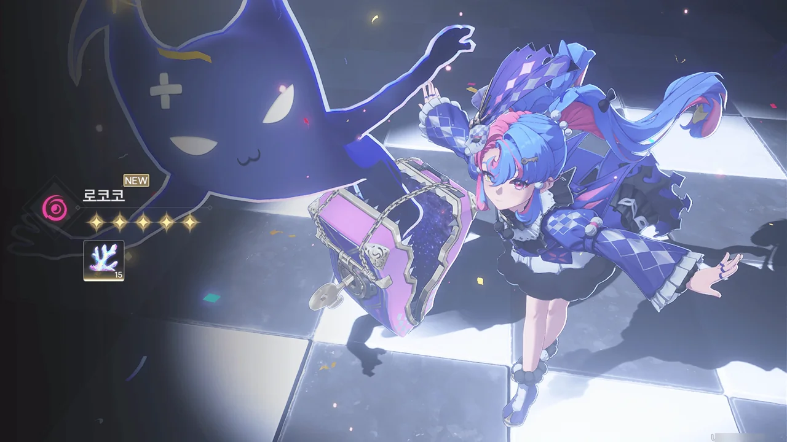
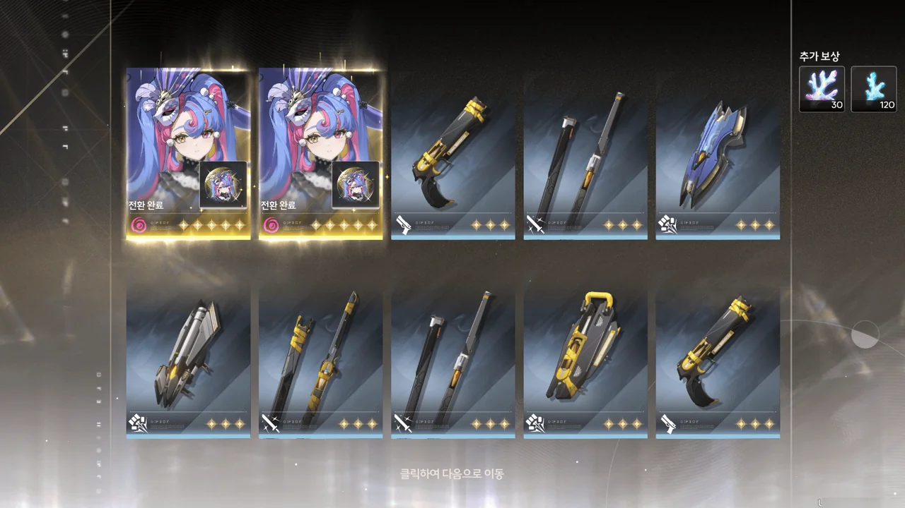
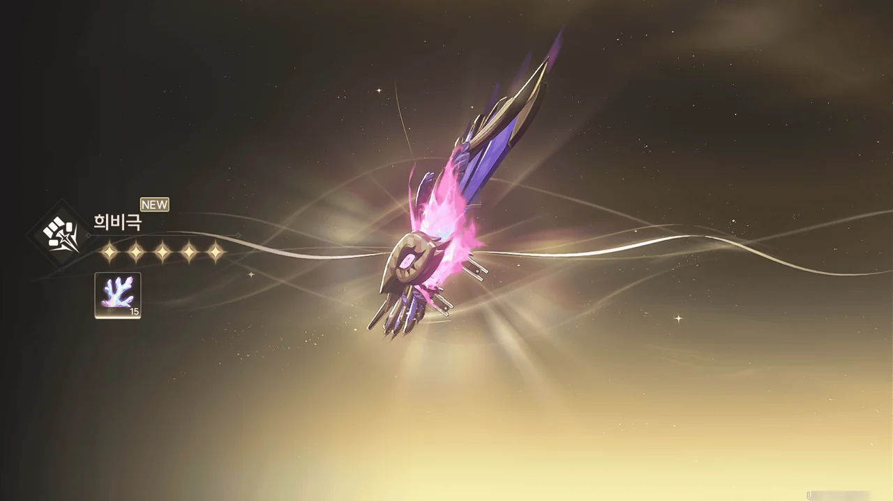

명조를 다시 설치하긴 했다.
다만 번역이 나아져서 다시 설치한 게 아니라, 1주년을 기념해 여태껏 나온 모든 캐릭터 튜닝을 모두 두 번에 나눠 복각한다는 이야기를 들었기 때문이다.
그러려면 일단 튜닝을 대비해 열심히 별소리를 모아야 할 것 아니겠는가.

그래서 명조를 다시 시작했다.

&nbsp;

내가 복귀할 때는 젠니 튜닝과 1주년 캐릭터 이벤트 튜닝이 막 시작한 때였다.

리나시타 스토리를 다 민 것도 아니고, 젠니의 전투 스타일도 뭔가 애매하게 느껴져 젠니 튜닝은 건너뛰기로 했다.
이벤트 튜닝 시즌 1에서 탐나는 건 페비 하나밖에 없었다. 나머지 캐릭터는 전부 명함 정도는 갖고 있었거든.
다만 페비를 제대로 쓰려면 젠니가 필요했고, 캐릭터 둘을 뽑을 정도로 재화가 여유롭지 않은 나는 페비도 건너뛰기로 했다.

그다음 열린 튜닝은 샤콘 튜닝과 1주년 캐릭터 이벤트 시즌 2였다.

난 샤콘을 튜닝 화면에서 처음 봤다. 전투 스타일을 보니 서포터인 것 같기에 일단 넘기기로 했다. 더 중요한 캐릭터도 있고 하니까.
이벤트 튜닝 시즌 2에서 내가 노린 건 로코코와 장리였다. 어디에 붙여도 어딘가 애매한 장리와 달리 로코코는 카멜리아와 찰떡궁합을 자랑했기에, 이번에 노리는 건 자연스럽게 로코코가 되었다.

***

블로그에 글을 올리지 않았을 뿐이지, 게임은 계속하고 있었다.

5월 22일, 로코코를 뽑았다.

내 목표는 명함 + 전무였기에, 곧바로 로코코 전무인 '희비극' 튜닝으로 넘어갔다.

&nbsp;

슬슬 무기 튜닝 천장인 80회가 거의 다 차오를 즈음, 위키에서 '로코코를 1체인으로 만들면 편의성이 정말 좋아진다'라는 말을 들었다.
마침, 캐릭터 튜닝 재화, '금빛 파도의 무늬'가 25개 있었기에, 속는 셈 치고 로코코 튜닝을 돌리기로 했다.

&nbsp;

첫 10 연차. 감심이 나왔다.
로코코를 뽑고 곧바로 캐릭터 튜닝을 그만두었기에, 5성이 10 연차만에 나온 것이다.

그 다음 10 연차.

에... 에엣?! 로코코가 두 번이나 나왔다고요?
그 자리에서 두 팔을 하늘 위로 번쩍 들고 만세를 외쳤다. 이런 날이 내게 오기는 하는구나?

&nbsp;

5성이 총 세 번 나왔기에 '여파의 산호' 역시 대량으로 나왔다. 그걸 전부 무기 튜닝 재화인 '울린 조수의 무늬'로 교환하니 딱 10개가 되었다.

ㅋㅋㅋㅋㅋㅋㅋㅋㅋㅋㅋㅋ

무기 튜닝은 거의 천장이긴 해도, 이게 곧바로 나올 줄은 몰랐다.

오늘 본 5성만 무려 네 번이라고!



그래서 곧바로 로코코를 2체인으로 만들고 무기도 90레벨까지 다 올렸다.

&nbsp;

아... 행복해. 늘 가챠 운이 없다고 생각했는데, 이렇게 미친 운빨을 보는 날이 오기는 하는구나...
