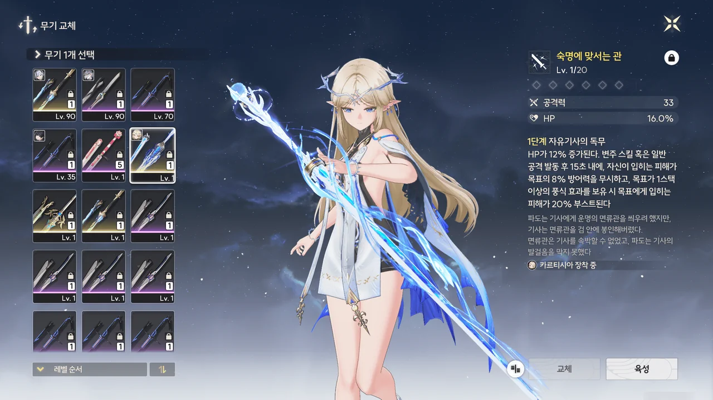

원래 카르티시아를 뽑을 생각이 전혀 없었다.
뽑을 생각이 있었다면 샤콘 픽업을 그냥 넘기지 않았겠지.

하... 하지만! 카르티시아가 조수 임무에서 너무 잘 나왔는 걸!
그래서 필수 파츠라고 해도 좋을 샤콘이 없음에도 카르티시아 픽업에 모든 걸 걸어버렸다.

별소리를 얻기 위해서 정말 많은 걸 했다.

새로운 지역을 열기 위해 조수 임무를 서둘러 밀었다.
리나시타의 조수 임무는 제1막까지만 끝낸 상태로 방치 중이었는데, 가장 최근에 열린 지역인 '일곱 언덕'에 도달하기 위해 제5막의 초입 부분까지 정말 쉬지 않고 밀었다.

당연한 이야기겠지만, 땅 파먹기도 게을리하지 않았다.
조수 임무를 진행하며 새로 열게 된 아베라르도 금고 아래층, 베오 해역, 아비놀룸, 리졸리 군도, 일곱 언덕 모두를 정말 박박 긁어먹었다. 남은 건 얽힌 별 임무나 위험한 임무에 엮여 있는 상자 정도가 전부이다.

이벤트 역시 필사적으로 매달렸다.
새로 추가된 이벤트 대다수가 일곱 언덕 지역을 해금할 것을 전제로 달고 있었기에, 서둘러 리나시타 조수 임무를 제5막 초입까지 서둘러 끝냈다.
여러 임무와 지역을 진행하며 '천도의 가이드' 이벤트 보상을 타먹었고, '조수를 향한 발자취' 역시 조수 임무를 끝낸 만큼 쓸어 담았다. 리졸리 군도와 연관 깊은 '노인, 물고기와 바다' 이벤트는 아예 끝을 보았고, '동행의 추억을 따라'나 '죽음의 노래와 바닷속 폐허'는 할 수 있는 곳까지 미친 듯이 달렸다.

그렇게 열심히 재화를 아득바득 긁어모으며 한 땀 한 땀 픽업을 돌리던 중, 남은 픽업 기간이 하루가 채 남지 않았을 무렵에 겨우 카르티시아와 전무를 모두 뽑을 수 있었다.



... 정말 힘든 시간이었어...

그래도 기분은 좋다.

정작 카르티시아와 전무를 키울 재화는 많이 모으지 않아, 앞으로 카르티시아를 육성하는 데 많은 시간이 들겠지만 말이다.
