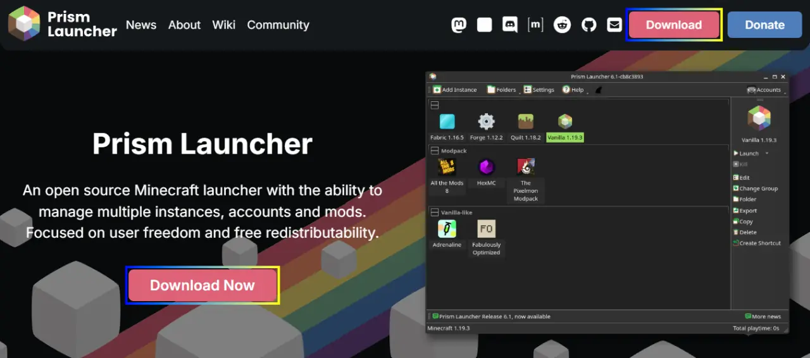
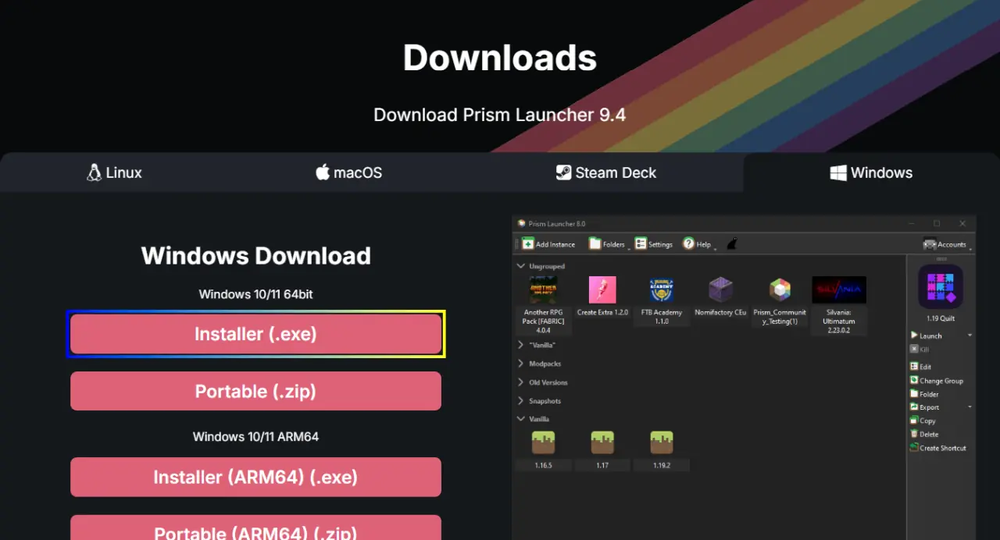

Prism Launcher는 여러 개의 Minecraft: Java Edition 인스턴스와 Minecraft 계정, 모드 등을 관리할 수 있는 오픈 소스 소프트웨어입니다.
Microsoft가 제공하는 Minecraft Launcher보다 사용이 매우 편리하기에, Minecraft: Java Edition을 플레이하는 사람에게 권장되는 프로그램 중 하나입니다.

이 글에서는 Prism Launcher를 다운로드하고 설치하는 방법에 대해 설명합니다.

> [!NOTE] 참고
> 이 튜토리얼은 Prism Launcher 9.4를 기준으로 작성되었습니다.

# 다운로드{id="download"}

먼저 [공식 홈페이지](https://prismlauncher.org)에서 Prism Launcher를 다운로드합니다.

<link-preview url="https://prismlauncher.org" title="Prism Launcher - Home" desc="An Open Source Minecraft launcher with the ability to manage multiple instances, accounts and mods. Focused on user freedom and free redistributability." image="https://prismlauncher.org/img/favicon.png"></link-preview>

<kbd>Download</kbd> 혹은 <kbd>Download Now</kbd> 버튼을 눌러 다운로드 페이지로 이동합니다.

현재 사용 중인 OS에 따라 나타나는 버튼이 달라지게 됩니다.
대부분의 PC 이용자가 Windows 10/11 64bit를 사용 중이기 때문에, 거기에 맞춰 안내하겠습니다.

<kbd>Installer (.exe)</kbd> 버튼을 눌러 Prism Launcher 설치 파일을 다운로드합니다.
Portable은 이러한 부류의 프로그램 설치 및 사용이 익숙한 사람을 위한 항목이므로, 이 글에서 다루지 않습니다.

# 설치{id="install"}

다운로드한 설치 파일을 실행합니다.



* [x] Visual Studio Runtime: Prism Launcher 실행에 있어 반드시 필요한 항목입니다.
* [x] Start Menu Shortcut: 시작 메뉴에 바로가기를 추가합니다.
* [x] Desktop Shortcut: 바탕 화면에 바로가기를 추가합니다.
* [ ] Shell Association (Open-With dialog): 우클릭 메뉴에 Prism Launcher를 추가합니다.



# 빠른 설치 마법사{id="wizard"}

Prism Launcher를 처음 실행하면 빠른 설치 마법사가 나타납니다.



Prism Launcher의 기본적인 외형 설정을 진행합니다.



Minecraft를 플레이하기 위해서는 Minecraft를 보유한 Microsoft 계정으로의 로그인이 필요하기 때문에, 빠른 설정 마법사에서 Microsoft 계정 추가도 같이 진행합니다.
Microsoft에 로그인한 후, Xbox 계정 접근에 동의하셔야 합니다.



모든 설정이 완료되었다면 위와 같이 Prism Launcher 메인 창이 나타나고, 우측 상단에 본인의 Minecraft 닉네임이 표시됩니다.
