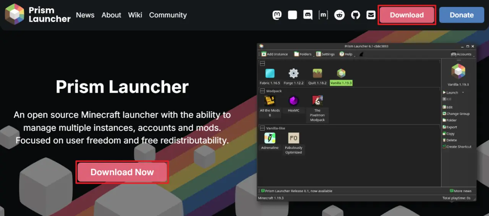
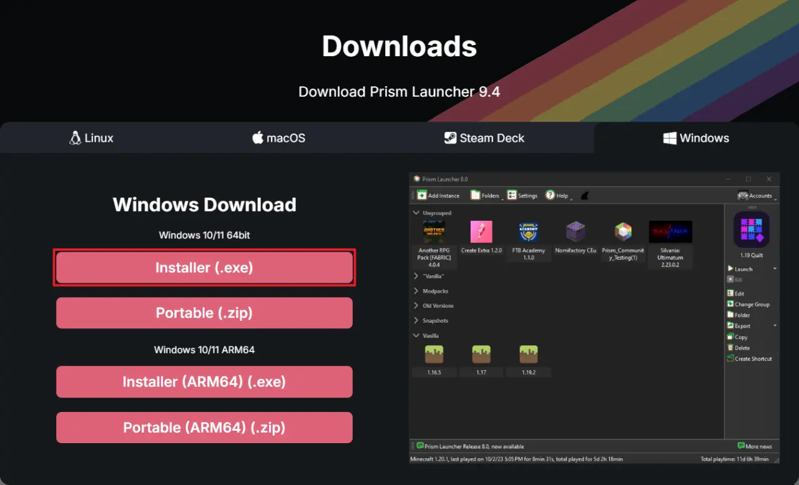
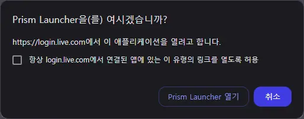

Prism Launcher는 여러 개의 Minecraft: Java Edition 인스턴스와 Minecraft 계정, 모드 등을 관리할 수 있는 오픈 소스 소프트웨어입니다.
Microsoft가 제공하는 Minecraft Launcher보다 사용이 매우 편리하기에, Minecraft: Java Edition을 플레이하는 사람에게 권장되는 프로그램 중 하나입니다.

이 글에서는 Prism Launcher를 다운로드하고 사용하는 방법에 대해 간략하게 설명합니다.

> [!NOTE] 참고
> 이 튜토리얼은 Prism Launcher 9.4를 기준으로 작성되었습니다.

# Prism Launcher 다운로드 및 설치{id="download-and-install"}

## 다운로드{id="download"}

먼저 공식 홈페이지에서 Prism Launcher를 다운로드합니다.

<link-preview url="https://prismlauncher.org" title="Prism Launcher - Home" desc="An Open Source Minecraft launcher with the ability to manage multiple instances, accounts and mods. Focused on user freedom and free redistributability." image="https://prismlauncher.org/img/favicon.png"></link-preview>



<kbd>Download</kbd> 혹은 <kbd>Download Now</kbd> 버튼을 눌러 다운로드 페이지로 이동합니다.



현재 사용 중인 OS에 따라 나타나는 버튼이 달라지게 됩니다.
대부분의 PC 이용자가 Windows 10/11 64bit를 사용 중이기 때문에, 거기에 맞춰 안내하겠습니다.

<kbd>Installer (.exe)</kbd> 버튼을 눌러 Prism Launcher 설치 파일을 다운로드합니다.
Portable은 이러한 부류의 프로그램 설치 및 사용이 익숙한 사람을 위한 항목이므로, 이 글에서 다루지 않습니다.

## 설치{id="install"}

다운로드한 설치 파일을 실행합니다.





* [x] Visual Studio Runtime: Prism Launcher 실행에 있어 반드시 필요한 항목입니다.
* [x] Start Menu Shortcut: 시작 메뉴에 바로가기를 추가합니다.
* [x] Desktop Shortcut: 바탕 화면에 바로가기를 추가합니다.
* [ ] Shell Association (Open-With dialog): 우클릭 메뉴에 Prism Launcher를 추가합니다.

## 빠른 설정 마법사{id="wizard"}



Prism Launcher의 기본적인 외형 설정을 진행합니다.





Minecraft를 플레이하기 위해서는 Minecraft를 보유한 Microsoft 계정으로의 로그인이 필요하기 때문에, 빠른 설정 마법사에서 Microsoft 계정 추가도 같이 진행합니다.
Microsoft에 로그인한 후, Xbox 계정 접근에 동의하셔야 합니다.



모든 설정이 완료되었다면 위와 같이 Prism Launcher 메인 창이 나타나고, 우측 상단에 본인의 Minecraft 닉네임이 표시됩니다.

## 초기 설정{id="basic-configuration"}

모든 Minecraft 인스턴스에 기본적으로 적용될 설정을 진행합니다.

메인 창 상단의 <kbd>설정</kbd> 버튼을 눌러주세요.



Minecraft의 기본 창 크기는 854x480입니다. 하지만 이 크기는 너무 작기 때문에, 개인 취향에 맞추어 창 크기를 조절합니다.

* 기본 비율 (427:240)
  * 854x480
  * 1281x720
  * 1708x960
* 16:9 비율
  * 1280x720
  * 1296x729
  * 1312x738



모드를 추가하면 추가할수록 Minecraft는 많은 양의 메모리를 필요로 하게 됩니다.
본인의 PC 사용 환경에 따라 최소 메모리 할당량과 최대 메모리 할당량을 설정해 주세요.

| | |
|:-:|:-:|
| | 권장 메모리 할당량 (최소 / 최대) |
| 모드 X | 2048 MiB / 2048 MiB (2 GiB) |
| 모드 O | 4096 MiB / 4096 MiB (4 GiB)<br>6144 MiB / 6144 MiB (6 GiB)<br><b>8192 MiB / 8192 MiB (8 GiB, 권장)</b> |
{_align=middle,_thead=false,style="width:50%;min-width:400px"}

최소 메모리 할당량과 최대 메모리 할당량을 동일하게 설정해야 게임 플레이 중 렉이 덜 걸립니다.

최대 메모리 할당량을 현재 시스템에 설치된 메모리 용량보다 높게 설정할 경우, 오른쪽의 초록색 체크 박스가 붉은색 엑스 박스로 변합니다.



Minecraft 실행에 사용할 Java 런타임을 지정할 수 있습니다.

Java 런타임에 대해 잘 모른다면 위 사진처럼 Java 경로를 비워두고 다음 두 항목을 체크하세요.

* [x] Java 버전 자동 감지
* [x] Mojang Java 자동 다운로드

Mojang이 제공하는 Java 런타임을 자동으로 다운로드하여 사용합니다.

&nbsp;

본인이 별도로 설치한 Java 런타임을 사용하고 싶다면 <kbd>자동 감지</kbd> 버튼을 누르세요.



현재 시스템에 설치된 Java 런타임 목록을 볼 수 있습니다. 대부분의 경우, `javaw`를 선택하면 됩니다.



JVM 실행 인수를 지정할 수 있습니다. 다음 내용을 복사해 붙여 넣으면 됩니다.

```plaintext
--add-modules=jdk.incubator.vector -XX:+UseG1GC -XX:+ParallelRefProcEnabled -XX:MaxGCPauseMillis=200 -XX:+UnlockExperimentalVMOptions -XX:+DisableExplicitGC -XX:+AlwaysPreTouch -XX:G1HeapWastePercent=5 -XX:G1MixedGCCountTarget=4 -XX:InitiatingHeapOccupancyPercent=15 -XX:G1MixedGCLiveThresholdPercent=90 -XX:G1RSetUpdatingPauseTimePercent=5 -XX:SurvivorRatio=32 -XX:+PerfDisableSharedMem -XX:MaxTenuringThreshold=1 -Dusing.aikars.flags=https://mcflags.emc.gs -Daikars.new.flags=true -XX:G1NewSizePercent=30 -XX:G1MaxNewSizePercent=40 -XX:G1HeapRegionSize=8M -XX:G1ReservePercent=20
```

대부분의 상황에서 Minecraft 플레이를 원활하게 조절해 줍니다.

# 인스턴스 생성{id="new-instance"}

Prism Launcher는 여러 개의 Minecraft 인스턴스를 생성하고 관리할 수 있습니다.
각 인스턴스의 설정 및 모드는 개별적으로 관리되며, 서로에게 영향을 끼치지 않습니다.

메인 창 상단의 <kbd>인스턴스 추가</kbd> 버튼을 눌러주세요.



공통적으로 창 상단에서 새 인스턴스의 이름과 그룹, 아이콘을 지정할 수 있습니다.

## 사용자 정의{id="new-instance-custom"}



직접 모드팩을 만들고자 할 때 사용하는 옵션입니다.

마인크래프트 버전과 모드 로더를 선택하여 빈 모드팩을 생성합니다.

## 모드팩{id="new-instance-modpack"}

모드팩을 불러오는 방식에는 두 가지가 있습니다.

### 불러오기{id="new-instance-file"}



모드팩 파일을 갖고 있을 때 사용하는 옵션입니다.

Prism Launcher는 다음과 같은 파일 형식을 지원합니다.

* CurseForge 모드팩 (`.zip`)
* Modrinth 모드팩 (`.mrpack`)
* Technic 모드팩 (`.zip`)
* Prism Launcher · PolyMC · MultiMC 모드팩 (`.zip`)

만약 Prism Launcher가 `.zip` 확장자를 가진 모드팩 파일을 제대로 불러오지 못한다면, 해당 ZIP 파일의 압축을 해제해 보세요.
ZIP 파일 내부의 `.zip`/`.mrpack` 파일을 Prism Launcher에서 불러와야 합니다.

### 공개 모드팩{id="new-instance-public"}





Prism Launcher는 ATLauncher, CurseForge, FTB, Modrinth, Technic에 등재된 모드팩을 직접 불러올 수 있습니다.

선택한 모드팩의 아이콘과 이름이 자동으로 새 인스턴스의 아이콘과 이름으로 설정됩니다.



일부 CurseForge 모드의 경우, 공식 앱이 아닌 프로그램의 다운로드를 차단하여 Prism Launcher가 해당 모드를 다운로드하지 못할 수 있습니다.

<kbd>누락된 링크 열기</kbd> 버튼을 눌러 웹 브라우저를 통해 해당 모드를 다운로드하면 Prism Launcher가 다운로드된 모드를 자동으로 인식하여 사용하게 됩니다.

# 모드팩 업데이트{id="modpack-update"}

Prism Launcher는 모드팩의 업데이트 기능을 제공합니다.

## 불러온 모드팩 업데이트{id="custom-update"}



CurseForge, FTB, Modrinth, Technic에 등재된 모드팩이 아닐 경우, 다음 버전의 모드팩 파일을 직접 불러와 모드팩을 업데이트할 수 있습니다.

## 공개 모드팩 업데이트{id="public-update"}



CurseForge, FTB, Modrinth, Technic에 등재된 모드팩은 새 버전을 드롭다운 메뉴에서 선택하거나 모드팩 파일을 직접 불러와 모드팩을 업데이트할 수 있습니다.

# 모드 관리{id="mod-manage"}

Prism Launcher를 통해 인스턴스에 추가된 모드를 관리할 수 있습니다.

* 모드 추가
* 모드 제거
* 모드 비활성화
* 모드 업데이트



인스턴스의 우클릭 메뉴 혹은 우측 메뉴에서 <kbd>편집</kbd>을 누릅니다.

'모드' 탭에서 현재 설치된 모드 목록을 확인할 수 있습니다.

## 모드 추가{id="mod-add"}



새 모드를 다운로드하려면 우측의 <kbd>모드 다운로드</kbd> 버튼을 누릅니다.
이미 모드 파일을 다운로드했다면 <kbd>파일 추가</kbd> 버튼을 눌러 해당 모드 파일을 불러올 수 있습니다.



CurseForge 혹은 Modrinth에서 모드를 다운로드할 수 있습니다.

하단의 <kbd>다운로드에서 모드 선택하기</kbd> 버튼을 눌러 해당 모드를 다운로드 큐에 넣을 수 있습니다.

* 이미 설치된 모드: 기울임 글꼴 + 흰색 테두리
* 다운로드 큐에 추가된 모드: 굵은 글꼴 + 밑줄

설치할 모드를 모두 선택했다면 <kbd>검토 및 확정</kbd> 버튼을 눌러 다운로드 큐에 있는 모드와 해당 모드가 필요로 하는 의존성 모드 목록이 나타납니다.
<kbd>확인</kbd> 버튼을 누르면 모드가 다운로드됩니다.

## 모드 제거{id="mod-remove"}



제거할 모드를 선택한 후 우클릭 메뉴 혹은 우측 메뉴에서 <kbd>제거</kbd> 버튼을 누르면 선택한 모드가 인스턴스에서 제거됩니다.

## 모드 비활성화{id="mod-disable"}



비활성화할 모드를 선택한 후 우클릭 메뉴 혹은 우측 메뉴에서 <kbd>비활성화</kbd> 버튼을 누르면 선택한 모드가 인스턴스에서 비활성화됩니다.

비활성화된 모드는 Minecraft에서 인식하지 않습니다.

## 모드 업데이트{id="mod-update"}



업데이트를 확인할 모드를 선택한 후 우클릭 혹은 우측 메뉴에서 <kbd>업데이트 확인</kbd> 버튼을 누르면 선택한 모드에 업데이트가 있는지 확인합니다.
